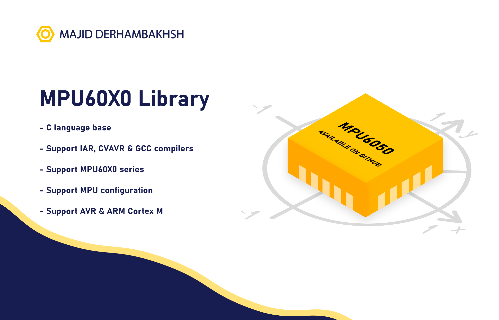

# MPU6050
"Easy To Use" MPU6050 library for using in AVR - ARM Cortex M



# MPU6050
"Easy To Use" MPU6050 library for using in AVR - ARM Cortex M

### Version : 1.0.0

- #### Type : Embedded Software.

- #### Support : All C/C++ compiler.

- #### Program Language : C

- #### Properties :

### Initialization and de-initialization functions:
```c++
uint8_t MPU6050_Init(uint16_t _time_out); /* Function for initialize MPU6050 */
uint8_t MPU6050_AutoInit(uint16_t _time_out); /* Function for initialize MPU6050 */
uint8_t MPU6050_DefInit(uint16_t _time_out); /* Function for initialize MPU6050 */

uint8_t MPU6050_Reset(uint16_t _time_out); /* Function for reset MPU6050 */
```  

### Operation functions:
```c++  
uint8_t MPU6050_IsReady(uint16_t _time_out); /* Function for check connection */

uint8_t MPU6050_SetDeviceID(uint8_t _id, uint16_t _time_out); /* Function for set MPU6050 id */
uint8_t MPU6050_GetDeviceID(uint8_t *_id, uint16_t _time_out); /* Function for get MPU6050 id */

/* ....................... Get Raw Value ....................... */
/* ------------- Accel ------------ */
uint8_t MPU6050_GetRawAccelX(int16_t *raw_accelx_value, uint16_t _time_out); /* Function for take Accelerometer (x) value */
uint8_t MPU6050_GetRawAccelY(int16_t *raw_accely_value, uint16_t _time_out); /* Function for take Accelerometer (y) value */
uint8_t MPU6050_GetRawAccelZ(int16_t *raw_accelz_value, uint16_t _time_out); /* Function for take Accelerometer (z) value */
uint8_t MPU6050_GetRawAccel( int16_t *raw_accel_str, uint16_t _time_out); /* Function for take Accelerometer value */

/* ------------- Temp ------------- */
uint8_t MPU6050_GetRawTemp(int16_t *raw_temp_value, uint16_t _time_out); /* Function for take Temperature value */

/* ------------- Gyro ------------- */
uint8_t MPU6050_GetRawGyroX(int16_t *raw_gyrox_value, uint16_t _time_out); /* Function for take Gyroscope (x) value */
uint8_t MPU6050_GetRawGyroY(int16_t *raw_gyroy_value, uint16_t _time_out); /* Function for take Gyroscope (y) value */
uint8_t MPU6050_GetRawGyroZ(int16_t *raw_gyroz_value, uint16_t _time_out); /* Function for take Gyroscope (z) value */
uint8_t MPU6050_GetRawGyro( int16_t *raw_gyro_str, uint16_t _time_out); /* Function for take Gyroscope value */

/* ......................... Get Value ......................... */
/* ------------- Accel ------------ */
uint8_t MPU6050_GetAccelX(float *accelx_value, uint16_t _time_out); /* Function for take Accelerometer (x) value */
uint8_t MPU6050_GetAccelY(float *accely_value, uint16_t _time_out); /* Function for take Accelerometer (y) value */
uint8_t MPU6050_GetAccelZ(float *accelz_value, uint16_t _time_out); /* Function for take Accelerometer (z) value */
uint8_t MPU6050_GetAccel( float *accel_str, uint16_t _time_out); /* Function for take Accelerometer value */

/* ------------- Temp ------------- */
uint8_t MPU6050_GetTemp(float *temp_value, uint16_t _time_out); /* Function for take Temperature value */

/* ------------- Gyro ------------- */
uint8_t MPU6050_GetGyroX(float *gyrox_value, uint16_t _time_out); /* Function for take Gyroscope (x) value */
uint8_t MPU6050_GetGyroY(float *gyroy_value, uint16_t _time_out); /* Function for take Gyroscope (y) value */
uint8_t MPU6050_GetGyroZ(float *gyroz_value, uint16_t _time_out); /* Function for take Gyroscope (z) value */
uint8_t MPU6050_GetGyro( float *gyro_str, uint16_t _time_out); /* Function for take Gyroscope value */

/* ................. Angle with accelerometer .................. */
uint8_t MPU6050_GetAccelAngleX(float *ang_x, uint16_t _time_out); /* Function for take x angle */
uint8_t MPU6050_GetAccelAngleY(float *ang_y, uint16_t _time_out); /* Function for take y angle */
uint8_t MPU6050_GetAccelAngleZ(float *ang_z, uint16_t _time_out); /* Function for take z angle */

``` 
### Macros:
```c++  
#define _MPU_AD0_LEVEL  
``` 

## How to use this library

### The MPU6050 library can be used as follows:
#### 1.  Add .h and source file in project.      
#### 2.  Config i2c in 'stm32_i2c_conf.h' for STM32 or 'i2c_unit_conf.h' for AVR header, for example:  
##### AVR Example:  
  ```c++  
  /* -------------------- Define -------------------- */

  #define _F_SCL      100000UL 
  #define _PRESCALER  _PRE1 

  /*
	  Guide :
			  _F_SCL	   : Specifies the clock frequency.
						  This parameter must be set to a value lower than 400kHz
			
			  _PRESCALER : i2c prescaler value argument is
						  _PRE1 , _PRE4 , _PRE16 , _PRE64
  */

  /* ------------------------------------------------ */
  ``` 
##### STM32 Example:  
  ```c++  
  /* ------- Required Headers ------ */
  //#include ".h" /* required headers */

  /* -------- Configuration -------- */
  #define STM32F1

  #define _CONNECTED_I2C hi2c1

  #define _MEM_DEF_VAL_BUFF_LENGTH 50

  /*
	  Guide   :
			    #define STM32Xx                    : STM32 Family.
			    #define _CONNECTED_I2C hi2c        : I2C structure to use in functions.
			  
			    #define _MEM_DEF_VAL_BUFF_LENGTH x : Buffer length for erase memory.
												    Increase length == Increase speed.
			  
	  Example :
			    #define STM32H7
			  
			    #define _CONNECTED_I2C hi2c1
			  
			    #define _MEM_DEF_VAL_BUFF_LENGTH 100
  */

  ``` 
  
#### 3.  Config Chipset in 'mpu6050_conf.h' header, for example:  
   * Options:  
   
      ```c++
      /* ~~~~~~~~~~~~~~ Required Headers ~~~~~~~~~~~~~ */
      #include "MATH_EX/math_ex.h" /* Import math lib */

      /* Driver-library for AVR */
      //#include "GPIO/gpio_unit.h" /* Import gpio lib */
      //#include "I2C_UNIT/i2c_unit.h" /* Import i2c lib */

      /* Driver-library for STM32 */
      #include "STM32_I2C/stm32_i2c.h" /* Import i2c lib */

      /* ~~~~~~~~~~~~~~~~ MPU Address ~~~~~~~~~~~~~~~~ */
      #define _MPU_AD0_LEVEL _MPU_AD0_LOW /* Set AD0 status */

      /* ~~~~~~~~~~~~~~~~~~~~~~~~~~~~~~~~~~~~~~~~~~~~~ */
      
      ```
          
          
#### 4.  Using initialize methods for initialize hardware and chipset, for example:  
```c++  
MPU6050_AutoInit(100);
```  
#### 5.  Using operation methods, for example:  
#### Example 1:  
```c++  
int main(void)
{
    /* ---------------------------------------- */
	  uint8_t com_resp = 0;
	
	  char str[_STR_LENGHT_FOR_LCD]; /* string for convert */
	
	  float x;
	  float y;
	  float z;
	  float temp;
	
	  /* ---------------------------------------- */
	  MPU6050_AutoInit(); /* Initialize hardware */
	
	  /* ---------------------------------------- */
	
	  Lcd_GotoXY(_LCD_COLUMN_5,0); /* Goto xy location in LCD */
	  Lcd_PutString("Hello"); /* Show Hello on LCD */
	  _Delay_Ms(_WAIT_FOR_NEXT_SHOW); /* Wait */
	  Lcd_Clear(); /* Clear LCD */
	
	  while (1) 
      {
		
		    com_resp  = MPU6050_GetAccelAngleX(&x, 100);
		    com_resp += MPU6050_GetAccelAngleY(&y, 100);
		    com_resp += MPU6050_GetAccelAngleZ(&z, 100);
		    com_resp += MPU6050_GetTemp(&temp, 100);
		
		    if (com_resp == (_MPU_OK * 4))
		    {
			
			      sprintf(str ,"%0.0f %0.0f %0.0f %0.2f" , x, y, z, temp); /* Convert value */
			      Lcd_Clear(); /* Clear LCD */
			      Lcd_GotoXY(0,0); /* Goto xy location in LCD */
			      Lcd_PutString(str); /* Show value on LCD */
			      Lcd_GotoXY(0,1); /* Goto xy location in LCD */
			      Lcd_PutString(" X   Y   Z   TMP"); /* Show value on LCD */
			
		    }
		    else
		    {
			
			      Lcd_Clear(); /* Clear LCD */
			      Lcd_GotoXY(0,0); /* Goto xy location in LCD */
			      Lcd_PutString("Error reading!"); /* Show value on LCD */
			
		    }
		
		    _DELAY_MS(500);
		
      }
}
   
``` 
#### Example 2:  
```c++  
int main(void)
{
    /* ---------------------------------------- */
	  uint8_t strLen = 0;
	  uint8_t com_resp = 0;

	  char str[50]; /* string for convert */

	  float x;
	  float y;
	  float z;
	
	  /* ---------------------------------------- */
	  MPU6050_AutoInit(); /* Initialize hardware */
	
	  /* ---------------------------------------- */
	
	  Lcd_GotoXY(_LCD_COLUMN_5,0); /* Goto xy location in LCD */
	  Lcd_PutString("Hello"); /* Show Hello on LCD */
	  _Delay_Ms(_WAIT_FOR_NEXT_SHOW); /* Wait */
	  Lcd_Clear(); /* Clear LCD */
	
	  while (1) 
      {
		
	      com_resp  = MPU6050_GetAccelAngleX(&x, 100);
	      com_resp += MPU6050_GetAccelAngleY(&y, 100);
	      com_resp += MPU6050_GetAccelAngleZ(&z, 100);

	      if (com_resp == (_MPU_OK * 3))
	      {

		      sprintf(str ,"X:%0.2f Y:%0.2f Z:%0.2f\n" , x,y,z); /* Convert value */

		      strLen = 0;
		      while(str[strLen] != '\0')
		      {
			      strLen++;
		      }

		      HAL_UART_Transmit(&huart1, (uint8_t *)str, strLen, 100);
	      }
	      else
	      {

		      HAL_UART_Transmit(&huart1, (uint8_t *)"Error reading!\n", 15, 100);

	      }

	      _DELAY_MS(100);
		
      }
}
   
``` 

## Supported Chipset:
- [x] MPU60X0 Series  

#### Developer: Majid Derhambakhsh

